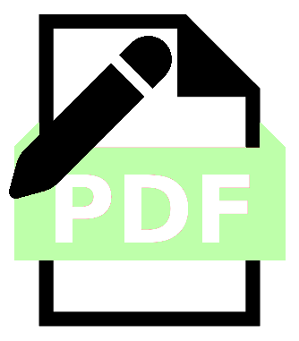

[![Contributors][contributors-shield]][contributors-url]
[![Forks][forks-shield]][forks-url]
[![Stargazers][stars-shield]][stars-url]
[![Issues][issues-shield]][issues-url]
[![MIT License][license-shield]][license-url]
[![LinkedIn][linkedin-shield]][linkedin-url]

	
	<h3 align="center">PDF Notes</h3>
	

	    A markdown oriented note taking website for .pdf files
	      
	    <a href="https://github.com/mrkcmn/PDF-Notes"><strong>Explore the docs</strong></a>
		·
	    <a href="https://github.com/mrkcmn/PDF-Notes/issues/new?labels=bug&template=bug-report---.md">Report Bug</a>
	    ·
	    <a href="https://github.com/mrkcmn/PDF-Notes/issues/new?labels=enhancement&template=feature-request---.md">Request Feature</a>
	

    
Table of Contents

    <ol>
	    <li><a href="#about-the-project">About The Project</a></li>
	    <li><a href="#usage">Usage</a></li>
	    <li><a href="#contributing">Contributing</a></li>
	    <li><a href="#license">License</a></li>
	    <li><a href="#contact">Contact</a></li>
	</ol>

## About The Project

PDF Notes is a light weight web app designed for easy, on-the-fly note taking on .pdf file.
The app currently only supports markdown format as a way to save the notes. More info ara available in the [[#usage]] section.

(<a href="#readme-top">back to top</a>)

## Usage

To use the application, please visit the GitHub page [website](https://mrkcmn.github.io/PDF-Notes/).

After choosing a .pdf file and clicking on "upload" the website will display the document's pages, each paired with a blank text area where to take notes related to the respective page.

The website offers a window option to select which pages —together with their relative sidenote— will be saved. Additionally, the user can manually select which pages to ignore during the saving process by using the buttons located next to them.

Finally, the user has the option to input a filename for the final markdown file.
After clicking on the "save" button, the website will start 2 downloads:
- a markdown file with the specified filename, containing the embedding syntax for all the selected document pages together with the optional notes (placed under the respective page)
- a zipped folder containing .png files for all the document pages embedded in the markdown file

(<a href="#readme-top">back to top</a>)

## Contributing

Contributions are what make the open source community such an amazing place to learn, inspire, and create. Any contributions you make are **greatly appreciated**.

If you have a suggestion that would make this better, please fork the repo and create a pull request. You can also simply open an issue with the tag "enhancement".
Don't forget to give the project a star! Thanks again!

1. Fork the Project
2. Create your Feature Branch (`git checkout -b feature/AmazingFeature`)
3. Commit your Changes (`git commit -m 'Add some AmazingFeature'`)
4. Push to the Branch (`git push origin feature/AmazingFeature`)
5. Open a Pull Request

(<a href="#readme-top">back to top</a>)

## License

Distributed under the MIT License. See `LICENSE.md` for more information.

(<a href="#readme-top">back to top</a>)

## Contact

[Tobia Marco Cimino](https://www.linkedin.com/in/tobia-marco-cimino-b6b69832a/)

(<a href="#readme-top">back to top</a>)

[contributors-shield]: https://img.shields.io/github/contributors/mrkcmn/PDF-Notes?style=for-the-badge
[contributors-url]: https://github.com/mrkcmn/PDF-Notes/graphs/contributors
[forks-shield]: https://img.shields.io/github/forks/mrkcmn/PDF-Notes?style=for-the-badge
[forks-url]: https://github.com/mrkcmn/PDF-Notes/network/members
[stars-shield]: https://img.shields.io/github/stars/mrkcmn/PDF-Notes?style=for-the-badge
[stars-url]: https://github.com/mrkcmn/PDF-Notes/stargazers
[issues-shield]: https://img.shields.io/github/issues/mrkcmn/PDF-Notes?style=for-the-badge
[issues-url]: https://github.com/mrkcmn/PDF-Notes/issues
[license-shield]: https://img.shields.io/github/license/mrkcmn/PDF-Notes?style=for-the-badge
[license-url]: https://github.com/mrkcmn/PDF-Notes/blob/master/LICENSE.md
[linkedin-shield]: https://img.shields.io/badge/-LinkedIn-black?style=for-the-badge&logo=linkedin&colorB=555
[linkedin-url]: https://www.linkedin.com/in/tobia-marco-cimino-b6b69832a/
[product-screenshot]: images/screenshot.png
[Next.js]: https://img.shields.io/badge/next.js-000000?style=for-the-badge&logo=nextdotjs&logoColor=white
[Next-url]: https://nextjs.org/
[React.js]: https://img.shields.io/badge/React-20232A?style=for-the-badge&logo=react&logoColor=61DAFB
[React-url]: https://reactjs.org/
[Vue.js]: https://img.shields.io/badge/Vue.js-35495E?style=for-the-badge&logo=vuedotjs&logoColor=4FC08D
[Vue-url]: https://vuejs.org/
[Angular.io]: https://img.shields.io/badge/Angular-DD0031?style=for-the-badge&logo=angular&logoColor=white
[Angular-url]: https://angular.io/
[Svelte.dev]: https://img.shields.io/badge/Svelte-4A4A55?style=for-the-badge&logo=svelte&logoColor=FF3E00
[Svelte-url]: https://svelte.dev/
[Laravel.com]: https://img.shields.io/badge/Laravel-FF2D20?style=for-the-badge&logo=laravel&logoColor=white
[Laravel-url]: https://laravel.com
[Bootstrap.com]: https://img.shields.io/badge/Bootstrap-563D7C?style=for-the-badge&logo=bootstrap&logoColor=white
[Bootstrap-url]: https://getbootstrap.com
[JQuery.com]: https://img.shields.io/badge/jQuery-0769AD?style=for-the-badge&logo=jquery&logoColor=white
[JQuery-url]: https://jquery.com
